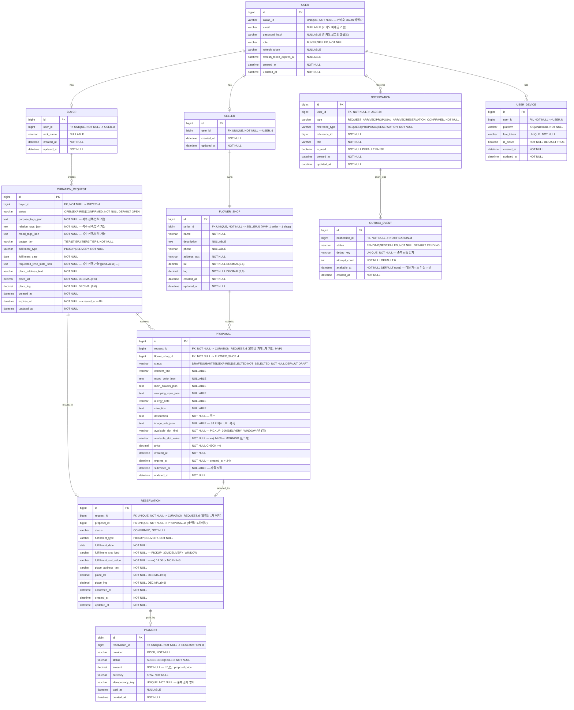

# erd.md — Florent ERD 명세

> AI는 이 ERD를 기준으로 Entity, Repository, Migration을 작성한다.
> ERD에 없는 컬럼/테이블을 임의로 추가하지 않는다.
> 변경이 필요하면 반드시 먼저 질문한다.

---

## 변경 이력

| 버전 | 변경 내용 |
|---|---|
| v1 | 초기 설계 |
| v2 | kakao_id 추가, email/password_hash NULLABLE 변경, refresh_token 추가, PROPOSAL image_urls_json 추가, NOTIFICATION 복합 UNIQUE 수정, OUTBOX_EVENT notification_id UNIQUE 제거, 슬롯 주석 명확화 |

---

## ERD 다이어그램



---

## 테이블별 설계 근거 및 주요 제약

### USER
- `kakao_id` : 카카오 OAuth 로그인의 유일 식별자. 이메일은 카카오 정책상 미제공 가능하므로 식별자로 사용 불가.
- `email`, `password_hash` : 카카오 로그인 전용 MVP에서는 NULLABLE. 자체 로그인 확장 시 활성화.
- `refresh_token` : Redis 없이 DB 컬럼으로 관리. 로그아웃 시 null 처리.
- `role` : BUYER | SELLER. 회원가입 시점에 역할 선택.

### BUYER / SELLER
- USER와 1:1. 역할별 확장 필드 분리.
- SELLER는 반드시 FLOWER_SHOP 1개를 가진다 (MVP).

### FLOWER_SHOP
- `lat`, `lng` : 요청 전송 시 반경 2km Bounding Box + Haversine 계산에 사용.
- 프로필 이미지: MVP 제외.

### CURATION_REQUEST
- `requested_time_slots_json` : 구매자는 **복수 선택 가능**. `[{"kind":"PICKUP_30M","value":"14:00"}, ...]`
- `place_lat`, `place_lng` : 픽업 장소 또는 배송 주소 좌표. 반경 계산 기준점.
- `expires_at` : `created_at + 48h`. 스케줄러가 이 값으로 OPEN → EXPIRED 처리.

### PROPOSAL
- `(request_id, flower_shop_id)` : **복합 UNIQUE** 권장 — 한 요청에 같은 가게가 중복 제안 불가 (MVP).
- `available_slot_kind / value` : 판매자는 **단 1개**만 제시 (구매자와 다름).
- `image_urls_json` : S3 Presigned URL로 업로드 후 URL 저장. NULLABLE.
- `expires_at` : `created_at + 24h`. 단, SELECTED 상태는 만료 처리 제외.
- `submitted_at` : DRAFT → SUBMITTED 전환 시점 기록.

### RESERVATION
- `request_id`, `proposal_id` 각각 UNIQUE → 요청당 1예약, 제안당 1예약 보장.
- `fulfillment_slot_kind / value` : 예약 확정 시점의 슬롯 스냅샷 (proposal 값 복사).
- `place_*` : 예약 확정 시점의 장소 스냅샷 (request 값 복사).
- MVP에서 취소/변경 없음.

### PAYMENT
- `amount` : 결제 시점의 `proposal.price` 스냅샷. 이후 proposal 변경과 무관.
- `idempotency_key` : UNIQUE. 네트워크 재시도로 인한 중복 결제 방지.
- MVP: `provider = MOCK`, 결제 수단 입력 없음.

### NOTIFICATION
- **복합 UNIQUE**: `(user_id, type, reference_id)` — 동일 이벤트에 대한 중복 알림 방지.
- 알림 3종: `REQUEST_ARRIVED`(판매자), `PROPOSAL_ARRIVED`(구매자), `RESERVATION_CONFIRMED`(판매자).

### OUTBOX_EVENT
- `dedup_key` UNIQUE로 중복 전송 방지. `notification_id`는 UNIQUE 아님(재발송 여지).
- `available_at` : exponential backoff 재시도 시간. Worker는 `available_at <= now()`인 것만 처리.
- `attempt_count > 3` → `status = FAILED` (DLQ 처리).

### USER_DEVICE
- 1명의 유저가 여러 디바이스 등록 가능 (1:N).
- `fcm_token` UNIQUE. 토큰 갱신 시 기존 레코드 업데이트.
- `is_active = false` : 앱 삭제 / FCM 토큰 만료 시.

---

## 알림 발송 규칙

| 이벤트 | 수신자 | type |
|---|---|---|
| 요청 생성 (반경 2km 가게) | 판매자 (가게별) | `REQUEST_ARRIVED` |
| 제안 제출 | 구매자 | `PROPOSAL_ARRIVED` |
| 예약 확정 (제안 선택 + 결제) | 판매자 (선택된 가게) | `RESERVATION_CONFIRMED` |

> 미선택 판매자에게는 알림을 보내지 않는다. 판매자 앱 내 상태 배지(NOT_SELECTED)로만 표시.

---

## 거리 계산 방식

```
1. Bounding Box 1차 필터 (SQL WHERE)
   lat BETWEEN (place_lat - delta) AND (place_lat + delta)
   lng BETWEEN (place_lng - delta) AND (place_lng + delta)
   (delta ≈ 0.018 for 2km)

2. Haversine 2차 필터 (서버 Java 코드)
   실제 구면 거리 계산 → 2km 초과 제거
```

MVP에서는 shop 수가 적다고 가정하여 전체 조회 후 서버 필터링도 허용.
PostGIS 확장은 MVP 범위 외.
"
    },
    "message": "Florent 최종 ERD 문서",
    "integration_name": null,
    "integration_icon_url": null,
    "icon_name": "file",
    "context": null,
    "display_content": {
      "type": "json_block",
      "json_block": "{"language": "markdown", "code": "# erd.md \— Florent ERD \명\세\
\
> AI\는 \이 ERD\를 \기\준\으\로 Entity, Repository, Migration\을 \작\성\한\다.\
> ERD\에 \없\는 \컬\럼/\테\이\블\을 \임\의\로 \추\가\하\지 \않\는\다.\
> \변\경\이 \필\요\하\면 \반\드\시 \먼\저 \질\문\한\다.\
\
---\
\
## \변\경 \이\력\
\
| \버\전 | \변\경 \내\용 |\
|---|---|\
| v1 | \초\기 \설\계 |\
| v2 | kakao_id \추\가, email/password_hash NULLABLE \변\경, refresh_token \추\가, PROPOSAL image_urls_json \추\가, NOTIFICATION \복\합 UNIQUE \수\정, OUTBOX_EVENT notification_id UNIQUE \제\거, \슬\롯 \주\석 \명\확\화 |\
\
---\
\
## ERD \다\이\어\그\램\
\
```mermaid\
erDiagram\
    USER {\
        bigint id PK\
        varchar kakao_id \"UNIQUE, NOT NULL \— \카\카\오 OAuth \식\별\자\"\
        varchar email \"NULLABLE (\카\카\오 \미\제\공 \가\능)\"\
        varchar password_hash \"NULLABLE (\카\카\오 \로\그\인 \불\필\요)\"\
        varchar role \"BUYER|SELLER, NOT NULL\"\
        varchar refresh_token \"NULLABLE\"\
        datetime refresh_token_expires_at \"NULLABLE\"\
        datetime created_at \"NOT NULL\"\
        datetime updated_at \"NOT NULL\"\
    }\
\
    BUYER {\
        bigint id PK\
        bigint user_id \"FK UNIQUE, NOT NULL -> USER.id\"\
        varchar nick_name \"NULLABLE\"\
        datetime created_at \"NOT NULL\"\
        datetime updated_at \"NOT NULL\"\
    }\
\
    SELLER {\
        bigint id PK\
        bigint user_id \"FK UNIQUE, NOT NULL -> USER.id\"\
        datetime created_at \"NOT NULL\"\
        datetime updated_at \"NOT NULL\"\
    }\
\
    FLOWER_SHOP {\
        bigint id PK\
        bigint seller_id \"FK UNIQUE, NOT NULL -> SELLER.id (MVP: 1 seller = 1 shop)\"\
        varchar name \"NOT NULL\"\
        text description \"NULLABLE\"\
        varchar phone \"NULLABLE\"\
        varchar address_text \"NOT NULL\"\
        decimal lat \"NOT NULL DECIMAL(9,6)\"\
        decimal lng \"NOT NULL DECIMAL(9,6)\"\
        datetime created_at \"NOT NULL\"\
        datetime updated_at \"NOT NULL\"\
    }\
\
    CURATION_REQUEST {\
        bigint id PK\
        bigint buyer_id \"FK, NOT NULL -> BUYER.id\"\
        varchar status \"OPEN|EXPIRED|CONFIRMED, NOT NULL DEFAULT OPEN\"\
        text purpose_tags_json \"NOT NULL \— \복\수 \선\택/\입\력 \가\능\"\
        text relation_tags_json \"NOT NULL \— \복\수 \선\택/\입\력 \가\능\"\
        text mood_tags_json \"NOT NULL \— \복\수 \선\택/\입\력 \가\능\"\
        varchar budget_tier \"TIER1|TIER2|TIER3|TIER4, NOT NULL\"\
        varchar fulfillment_type \"PICKUP|DELIVERY, NOT NULL\"\
        date fulfillment_date \"NOT NULL\"\
        text requested_time_slots_json \"NOT NULL \— \복\수 \선\택 \가\능 [{kind,value},...]\"\
        varchar place_address_text \"NOT NULL\"\
        decimal place_lat \"NOT NULL DECIMAL(9,6)\"\
        decimal place_lng \"NOT NULL DECIMAL(9,6)\"\
        datetime created_at \"NOT NULL\"\
        datetime expires_at \"NOT NULL \— created_at + 48h\"\
        datetime updated_at \"NOT NULL\"\
    }\
\
    PROPOSAL {\
        bigint id PK\
        bigint request_id \"FK, NOT NULL -> CURATION_REQUEST.id (\요\청\당 \가\게 1\개 \제\안, MVP)\"\
        bigint flower_shop_id \"FK, NOT NULL -> FLOWER_SHOP.id\"\
        varchar status \"DRAFT|SUBMITTED|EXPIRED|SELECTED|NOT_SELECTED, NOT NULL DEFAULT DRAFT\"\
        varchar concept_title \"NULLABLE\"\
        text mood_color_json \"NULLABLE\"\
        text main_flowers_json \"NULLABLE\"\
        text wrapping_style_json \"NULLABLE\"\
        varchar allergy_note \"NULLABLE\"\
        text care_tips \"NULLABLE\"\
        text description \"NOT NULL \— \필\수\"\
        text image_urls_json \"NULLABLE \— S3 \이\미\지 URL \목\록\"\
        varchar available_slot_kind \"NOT NULL \— PICKUP_30M|DELIVERY_WINDOW (\단 1\개)\"\
        varchar available_slot_value \"NOT NULL \— ex) 14:00 or MORNING (\단 1\개)\"\
        decimal price \"NOT NULL CHECK > 0\"\
        datetime created_at \"NOT NULL\"\
        datetime expires_at \"NOT NULL \— created_at + 24h\"\
        datetime submitted_at \"NULLABLE \— \제\출 \시\점\"\
        datetime updated_at \"NOT NULL\"\
    }\
\
    RESERVATION {\
        bigint id PK\
        bigint request_id \"FK UNIQUE, NOT NULL -> CURATION_REQUEST.id (\요\청\당 1\개 \예\약)\"\
        bigint proposal_id \"FK UNIQUE, NOT NULL -> PROPOSAL.id (\제\안\당 1\개 \예\약)\"\
        varchar status \"CONFIRMED, NOT NULL\"\
        varchar fulfillment_type \"PICKUP|DELIVERY, NOT NULL\"\
        date fulfillment_date \"NOT NULL\"\
        varchar fulfillment_slot_kind \"NOT NULL \— PICKUP_30M|DELIVERY_WINDOW\"\
        varchar fulfillment_slot_value \"NOT NULL \— ex) 14:00 or MORNING\"\
        varchar place_address_text \"NOT NULL\"\
        decimal place_lat \"NOT NULL DECIMAL(9,6)\"\
        decimal place_lng \"NOT NULL DECIMAL(9,6)\"\
        datetime confirmed_at \"NOT NULL\"\
        datetime created_at \"NOT NULL\"\
        datetime updated_at \"NOT NULL\"\
    }\
\
    PAYMENT {\
        bigint id PK\
        bigint reservation_id \"FK UNIQUE, NOT NULL -> RESERVATION.id\"\
        varchar provider \"MOCK, NOT NULL\"\
        varchar status \"SUCCEEDED|FAILED, NOT NULL\"\
        decimal amount \"NOT NULL \— \스\냅\샷: proposal.price\"\
        varchar currency \"KRW, NOT NULL\"\
        varchar idempotency_key \"UNIQUE, NOT NULL \— \중\복 \결\제 \방\지\"\
        datetime paid_at \"NULLABLE\"\
        datetime created_at \"NOT NULL\"\
    }\
\
    NOTIFICATION {\
        bigint id PK\
        bigint user_id \"FK, NOT NULL -> USER.id\"\
        varchar type \"REQUEST_ARRIVED|PROPOSAL_ARRIVED|RESERVATION_CONFIRMED, NOT NULL\"\
        varchar reference_type \"REQUEST|PROPOSAL|RESERVATION, NOT NULL\"\
        bigint reference_id \"NOT NULL\"\
        varchar title \"NOT NULL\"\
        boolean is_read \"NOT NULL DEFAULT FALSE\"\
        datetime created_at \"NOT NULL\"\
        datetime updated_at \"NOT NULL\"\
    }\
\
    OUTBOX_EVENT {\
        bigint id PK\
        bigint notification_id \"FK, NOT NULL -> NOTIFICATION.id\"\
        varchar status \"PENDING|SENT|FAILED, NOT NULL DEFAULT PENDING\"\
        varchar dedup_key \"UNIQUE, NOT NULL \— \중\복 \전\송 \방\지\"\
        int attempt_count \"NOT NULL DEFAULT 0\"\
        datetime available_at \"NOT NULL DEFAULT now() \— \다\음 \재\시\도 \가\능 \시\간\"\
        datetime created_at \"NOT NULL\"\
    }\
\
    USER_DEVICE {\
        bigint id PK\
        bigint user_id \"FK, NOT NULL -> USER.id\"\
        varchar platform \"IOS|ANDROID, NOT NULL\"\
        varchar fcm_token \"UNIQUE, NOT NULL\"\
        boolean is_active \"NOT NULL DEFAULT TRUE\"\
        datetime created_at \"NOT NULL\"\
        datetime updated_at \"NOT NULL\"\
    }\
\
    USER ||--o| BUYER : has\
    USER ||--o| SELLER : has\
    SELLER ||--|| FLOWER_SHOP : owns\
    BUYER ||--o{ CURATION_REQUEST : creates\
    CURATION_REQUEST ||--o{ PROPOSAL : receives\
    FLOWER_SHOP ||--o{ PROPOSAL : submits\
    CURATION_REQUEST ||--o| RESERVATION : results_in\
    PROPOSAL ||--o| RESERVATION : selected_for\
    RESERVATION ||--o| PAYMENT : paid_by\
    USER ||--o{ NOTIFICATION : receives\
    USER ||--o{ USER_DEVICE : has\
    NOTIFICATION ||--o{ OUTBOX_EVENT : push_jobs\
```\
\
---\
\
## \테\이\블\별 \설\계 \근\거 \및 \주\요 \제\약\
\
### USER\
- `kakao_id` : \카\카\오 OAuth \로\그\인\의 \유\일 \식\별\자. \이\메\일\은 \카\카\오 \정\책\상 \미\제\공 \가\능\하\므\로 \식\별\자\로 \사\용 \불\가.\
- `email`, `password_hash` : \카\카\오 \로\그\인 \전\용 MVP\에\서\는 NULLABLE. \자\체 \로\그\인 \확\장 \시 \활\성\화.\
- `refresh_token` : Redis \없\이 DB \컬\럼\으\로 \관\리. \로\그\아\웃 \시 null \처\리.\
- `role` : BUYER | SELLER. \회\원\가\입 \시\점\에 \역\할 \선\택.\
\
### BUYER / SELLER\
- USER\와 1:1. \역\할\별 \확\장 \필\드 \분\리.\
- SELLER\는 \반\드\시 FLOWER_SHOP 1\개\를 \가\진\다 (MVP).\
\
### FLOWER_SHOP\
- `lat`, `lng` : \요\청 \전\송 \시 \반\경 2km Bounding Box + Haversine \계\산\에 \사\용.\
- \프\로\필 \이\미\지: MVP \제\외.\
\
### CURATION_REQUEST\
- `requested_time_slots_json` : \구\매\자\는 **\복\수 \선\택 \가\능**. `[{\"kind\":\"PICKUP_30M\",\"value\":\"14:00\"}, ...]`\
- `place_lat`, `place_lng` : \픽\업 \장\소 \또\는 \배\송 \주\소 \좌\표. \반\경 \계\산 \기\준\점.\
- `expires_at` : `created_at + 48h`. \스\케\줄\러\가 \이 \값\으\로 OPEN \→ EXPIRED \처\리.\
\
### PROPOSAL\
- `(request_id, flower_shop_id)` : **\복\합 UNIQUE** \권\장 \— \한 \요\청\에 \같\은 \가\게\가 \중\복 \제\안 \불\가 (MVP).\
- `available_slot_kind / value` : \판\매\자\는 **\단 1\개**\만 \제\시 (\구\매\자\와 \다\름).\
- `image_urls_json` : S3 Presigned URL\로 \업\로\드 \후 URL \저\장. NULLABLE.\
- `expires_at` : `created_at + 24h`. \단, SELECTED \상\태\는 \만\료 \처\리 \제\외.\
- `submitted_at` : DRAFT \→ SUBMITTED \전\환 \시\점 \기\록.\
\
### RESERVATION\
- `request_id`, `proposal_id` \각\각 UNIQUE \→ \요\청\당 1\예\약, \제\안\당 1\예\약 \보\장.\
- `fulfillment_slot_kind / value` : \예\약 \확\정 \시\점\의 \슬\롯 \스\냅\샷 (proposal \값 \복\사).\
- `place_*` : \예\약 \확\정 \시\점\의 \장\소 \스\냅\샷 (request \값 \복\사).\
- MVP\에\서 \취\소/\변\경 \없\음.\
\
### PAYMENT\
- `amount` : \결\제 \시\점\의 `proposal.price` \스\냅\샷. \이\후 proposal \변\경\과 \무\관.\
- `idempotency_key` : UNIQUE. \네\트\워\크 \재\시\도\로 \인\한 \중\복 \결\제 \방\지.\
- MVP: `provider = MOCK`, \결\제 \수\단 \입\력 \없\음.\
\
### NOTIFICATION\
- **\복\합 UNIQUE**: `(user_id, type, reference_id)` \— \동\일 \이\벤\트\에 \대\한 \중\복 \알\림 \방\지.\
- \알\림 3\종: `REQUEST_ARRIVED`(\판\매\자), `PROPOSAL_ARRIVED`(\구\매\자), `RESERVATION_CONFIRMED`(\판\매\자).\
\
### OUTBOX_EVENT\
- `dedup_key` UNIQUE\로 \중\복 \전\송 \방\지. `notification_id`\는 UNIQUE \아\님(\재\발\송 \여\지).\
- `available_at` : exponential backoff \재\시\도 \시\간. Worker\는 `available_at <= now()`\인 \것\만 \처\리.\
- `attempt_count > 3` \→ `status = FAILED` (DLQ \처\리).\
\
### USER_DEVICE\
- 1\명\의 \유\저\가 \여\러 \디\바\이\스 \등\록 \가\능 (1:N).\
- `fcm_token` UNIQUE. \토\큰 \갱\신 \시 \기\존 \레\코\드 \업\데\이\트.\
- `is_active = false` : \앱 \삭\제 / FCM \토\큰 \만\료 \시.\
\
---\
\
## \알\림 \발\송 \규\칙\
\
| \이\벤\트 | \수\신\자 | type |\
|---|---|---|\
| \요\청 \생\성 (\반\경 2km \가\게) | \판\매\자 (\가\게\별) | `REQUEST_ARRIVED` |\
| \제\안 \제\출 | \구\매\자 | `PROPOSAL_ARRIVED` |\
| \예\약 \확\정 (\제\안 \선\택 + \결\제) | \판\매\자 (\선\택\된 \가\게) | `RESERVATION_CONFIRMED` |\
\
> \미\선\택 \판\매\자\에\게\는 \알\림\을 \보\내\지 \않\는\다. \판\매\자 \앱 \내 \상\태 \배\지(NOT_SELECTED)\로\만 \표\시.\
\
---\
\
## \거\리 \계\산 \방\식\
\
```\
1. Bounding Box 1\차 \필\터 (SQL WHERE)\
   lat BETWEEN (place_lat - delta) AND (place_lat + delta)\
   lng BETWEEN (place_lng - delta) AND (place_lng + delta)\
   (delta \≈ 0.018 for 2km)\
\
2. Haversine 2\차 \필\터 (\서\버 Java \코\드)\
   \실\제 \구\면 \거\리 \계\산 \→ 2km \초\과 \제\거\
```\
\
MVP\에\서\는 shop \수\가 \적\다\고 \가\정\하\여 \전\체 \조\회 \후 \서\버 \필\터\링\도 \허\용.\
PostGIS \확\장\은 MVP \범\위 \외.\
", "filename": "/mnt/user-data/outputs/docs/erd.md"}"
    },
    "approval_options": null,
    "approval_key": null,
    "is_mcp_app": null
  },
  {
    "start_timestamp": null,
    "stop_timestamp": null,
    "flags": null,
    "type": "tool_result",
    "tool_use_id": "toolu_01WeGpZiz1vk9qJ5rpAR6xPc",
    "name": "create_file",
    "content": [
      {
        "type": "text",
        "text": "File created successfully: /mnt/user-data/outputs/docs/erd.md",
        "uuid": "45467c79-0863-4dfa-9f02-720f5d6636b6"
      }
    ],
    "is_error": false,
    "structured_content": null,
    "meta": null,
    "message": null,
    "integration_name": null,
    "integration_icon_url": null,
    "icon_name": "file",
    "display_content": {
      "type": "text",
      "text": "File created successfully: /mnt/user-data/outputs/docs/erd.md"
    }
  },
  {
    "start_timestamp": "2026-03-04T08:05:21.893585Z",
    "stop_timestamp": "2026-03-04T08:05:22.095780Z",
    "flags": null,
    "type": "tool_use",
    "id": "toolu_01SyLxXCy3YRS2xAfi8LwW3s",
    "name": "present_files",
    "input": {
      "filepaths": [
        "/mnt/user-data/outputs/docs/erd.md"
      ]
    },
    "message": "Presenting file(s)...",
    "integration_name": null,
    "integration_icon_url": null,
    "icon_name": "file",
    "context": null,
    "display_content": {
      "type": "table",
      "table": [
        [
          "filepaths",
          "['/mnt/user-data/outputs/docs/erd.md']"
        ]
      ]
    },
    "approval_options": null,
    "approval_key": null,
    "is_mcp_app": null
  },
  {
    "start_timestamp": null,
    "stop_timestamp": null,
    "flags": null,
    "type": "tool_result",
    "tool_use_id": "toolu_01SyLxXCy3YRS2xAfi8LwW3s",
    "name": "present_files",
    "content": [
      {
        "type": "local_resource",
        "file_path": "/mnt/user-data/outputs/docs/erd.md",
        "name": "erd",
        "mime_type": "text/markdown",
        "uuid": "d28b06e7-94b1-40f3-b3c3-a246161aaa0f"
      }
    ],
    "is_error": false,
    "structured_content": null,
    "meta": null,
    "message": "Presented file",
    "integration_name": null,
    "integration_icon_url": null,
    "icon_name": "file",
    "display_content": null
  },
  {
    "start_timestamp": "2026-03-04T08:05:22.986934Z",
    "stop_timestamp": "2026-03-04T08:05:30.513599Z",
    "flags": null,
    "type": "text",
    "text": "ERD 확정됐어요. 원본 대비 바뀐 것 요약하면:

**수정 (필수)** — `kakao_id` 추가 + `email`/`password_hash` NULLABLE 변경, `refresh_token` 컬럼 추가, `PROPOSAL.image_urls_json` 추가, `NOTIFICATION` 복합 UNIQUE로 수정, `OUTBOX_EVENT.notification_id` UNIQUE 제거

**추가 (설계 명확화)** — 테이블별 설계 근거, 알림 발송 규칙 표, 거리 계산 방식, `PROPOSAL.(request_id, flower_shop_id)` 복합 UNIQUE 권장 명시

---

### 남은 문서 목록

- [x] ERD ← 방금 완성
- [x] 기술 스택
- [x] 비즈니스 규칙 명세
- [ ] API 명세 (`api-spec.md`)
- [ ] 패키지 구조 (`architecture.md`)
- [ ] 코딩 컨벤션 (`conventions.md`)
- [ ] `agent.md` 통합

다음은 **API 명세** 할까요?",
    "citations": []
  }
]

================================================================================

Human:
Content:
[
  {
    "start_timestamp": "2026-03-04T08:14:46.709347Z",
    "stop_timestamp": "2026-03-04T08:14:46.709347Z",
    "flags": null,
    "type": "text",
    "text": "응",
    "citations": []
  }
]

================================================================================

Assistant:
Content:
[
  {
    "start_timestamp": "2026-03-04T08:14:48.757089Z",
    "stop_timestamp": "2026-03-04T08:14:49.585426Z",
    "flags": null,
    "type": "text",
    "text": " ERD + 비즈니스 규칙 + 화면 IA 기반으로 API 명세 작성할게요.",
    "citations": []
  },
  {
    "start_timestamp": "2026-03-04T08:14:49.893448Z",
    "stop_timestamp": "2026-03-04T08:16:16.703028Z",
    "flags": null,
    "type": "tool_use",
    "id": "toolu_01CriyscXFRCh8gYfTdKXVUo",
    "name": "create_file",
    "input": {
      "description": "Florent API 명세 문서",
      "file_text": "# api-spec.md — Florent API 명세

> AI는 이 문서에 정의된 엔드포인트, 요청/응답 DTO, 상태코드만 사용한다.
> 임의로 엔드포인트를 추가하거나 응답 구조를 변경하지 않는다.
> 변경이 필요하면 반드시 먼저 질문한다.

---
