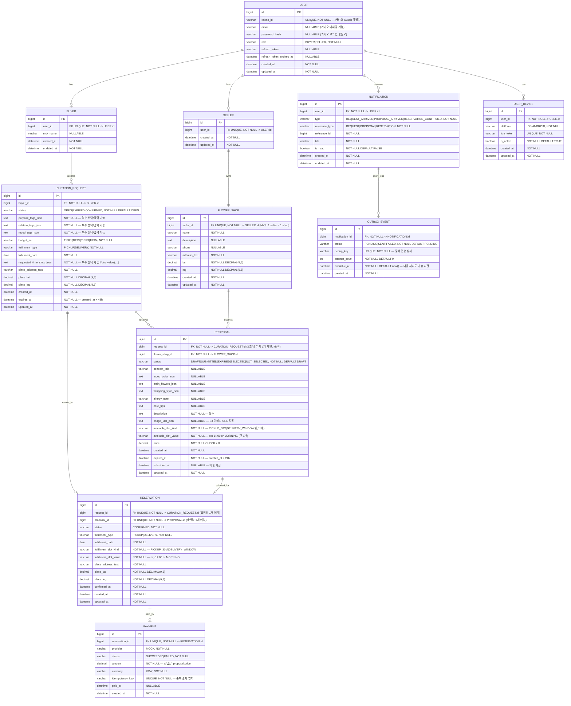

# erd.md — Florent ERD 명세

> AI는 이 ERD를 기준으로 Entity, Repository, Migration을 작성한다.
> ERD에 없는 컬럼/테이블을 임의로 추가하지 않는다.
> 변경이 필요하면 반드시 먼저 질문한다.

---

## 변경 이력

| 버전 | 변경 내용 |
|---|---|
| v1 | 초기 설계 |
| v2 | kakao_id 추가, email/password_hash NULLABLE 변경, refresh_token 추가, PROPOSAL image_urls_json 추가, NOTIFICATION 복합 UNIQUE 수정, OUTBOX_EVENT notification_id UNIQUE 제거, 슬롯 주석 명확화 |

---

## ERD 다이어그램



---

## 테이블별 설계 근거 및 주요 제약

### USER
- `kakao_id` : 카카오 OAuth 로그인의 유일 식별자. 이메일은 카카오 정책상 미제공 가능하므로 식별자로 사용 불가.
- `email`, `password_hash` : 카카오 로그인 전용 MVP에서는 NULLABLE. 자체 로그인 확장 시 활성화.
- `refresh_token` : Redis 없이 DB 컬럼으로 관리. 로그아웃 시 null 처리.
- `role` : BUYER | SELLER. 회원가입 시점에 역할 선택.

### BUYER / SELLER
- USER와 1:1. 역할별 확장 필드 분리.
- SELLER는 반드시 FLOWER_SHOP 1개를 가진다 (MVP).

### FLOWER_SHOP
- `lat`, `lng` : 요청 전송 시 반경 2km Bounding Box + Haversine 계산에 사용.
- 프로필 이미지: MVP 제외.

### CURATION_REQUEST
- `requested_time_slots_json` : 구매자는 **복수 선택 가능**. `[{"kind":"PICKUP_30M","value":"14:00"}, ...]`
- `place_lat`, `place_lng` : 픽업 장소 또는 배송 주소 좌표. 반경 계산 기준점.
- `expires_at` : `created_at + 48h`. 스케줄러가 이 값으로 OPEN → EXPIRED 처리.

### PROPOSAL
- `(request_id, flower_shop_id)` : **복합 UNIQUE** 권장 — 한 요청에 같은 가게가 중복 제안 불가 (MVP).
- `available_slot_kind / value` : 판매자는 **단 1개**만 제시 (구매자와 다름).
- `image_urls_json` : S3 Presigned URL로 업로드 후 URL 저장. NULLABLE.
- `expires_at` : `created_at + 24h`. 단, SELECTED 상태는 만료 처리 제외.
- `submitted_at` : DRAFT → SUBMITTED 전환 시점 기록.

### RESERVATION
- `request_id`, `proposal_id` 각각 UNIQUE → 요청당 1예약, 제안당 1예약 보장.
- `fulfillment_slot_kind / value` : 예약 확정 시점의 슬롯 스냅샷 (proposal 값 복사).
- `place_*` : 예약 확정 시점의 장소 스냅샷 (request 값 복사).
- MVP에서 취소/변경 없음.

### PAYMENT
- `amount` : 결제 시점의 `proposal.price` 스냅샷. 이후 proposal 변경과 무관.
- `idempotency_key` : UNIQUE. 네트워크 재시도로 인한 중복 결제 방지.
- MVP: `provider = MOCK`, 결제 수단 입력 없음.

### NOTIFICATION
- **복합 UNIQUE**: `(user_id, type, reference_id)` — 동일 이벤트에 대한 중복 알림 방지.
- 알림 3종: `REQUEST_ARRIVED`(판매자), `PROPOSAL_ARRIVED`(구매자), `RESERVATION_CONFIRMED`(판매자).

### OUTBOX_EVENT
- `dedup_key` UNIQUE로 중복 전송 방지. `notification_id`는 UNIQUE 아님(재발송 여지).
- `available_at` : exponential backoff 재시도 시간. Worker는 `available_at <= now()`인 것만 처리.
- `attempt_count > 3` → `status = FAILED` (DLQ 처리).

### USER_DEVICE
- 1명의 유저가 여러 디바이스 등록 가능 (1:N).
- `fcm_token` UNIQUE. 토큰 갱신 시 기존 레코드 업데이트.
- `is_active = false` : 앱 삭제 / FCM 토큰 만료 시.

---

## 알림 발송 규칙

| 이벤트 | 수신자 | type |
|---|---|---|
| 요청 생성 (반경 2km 가게) | 판매자 (가게별) | `REQUEST_ARRIVED` |
| 제안 제출 | 구매자 | `PROPOSAL_ARRIVED` |
| 예약 확정 (제안 선택 + 결제) | 판매자 (선택된 가게) | `RESERVATION_CONFIRMED` |

> 미선택 판매자에게는 알림을 보내지 않는다. 판매자 앱 내 상태 배지(NOT_SELECTED)로만 표시.

---

## 거리 계산 방식

```
1. Bounding Box 1차 필터 (SQL WHERE)
   lat BETWEEN (place_lat - delta) AND (place_lat + delta)
   lng BETWEEN (place_lng - delta) AND (place_lng + delta)
   (delta ≈ 0.018 for 2km)

2. Haversine 2차 필터 (서버 Java 코드)
   실제 구면 거리 계산 → 2km 초과 제거
```

MVP에서는 shop 수가 적다고 가정하여 전체 조회 후 서버 필터링도 허용.
PostGIS 확장은 MVP 범위 외.
